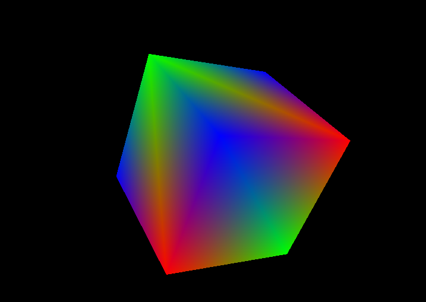

## NOTE!
Actually, source code was written in C until [2f39899](https://github.com/Naakinn/SDL-OpenGL/commit/2f39899121f83aa5105a7b22a32d6e0a9533e30d). However, still uses C-style code(structs, instead of classes for eg.) 

## Preview (outdated)

## Usage
### Build
```
$ cmake -B build
$ cmake --build build 
```
### Run 
```
$ ./engine
```
